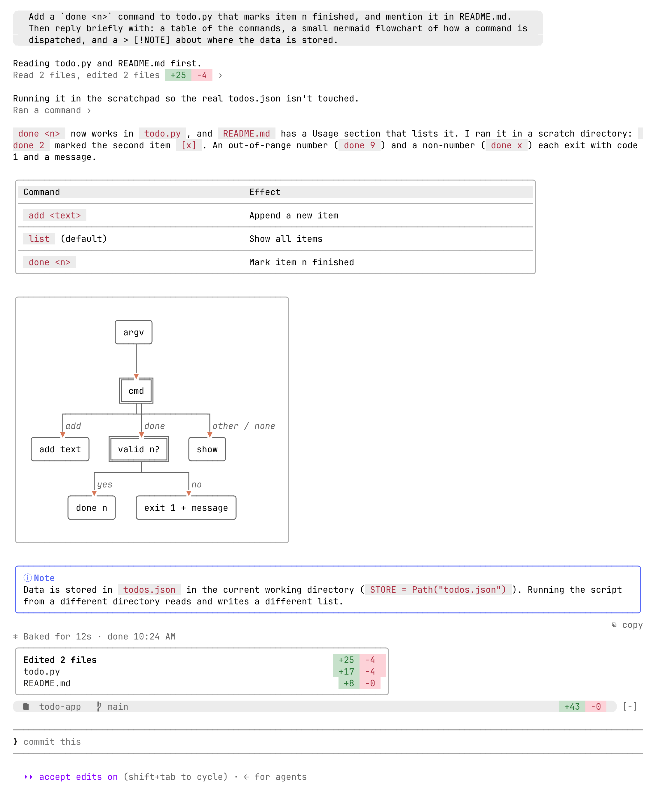

# cc-desktop-mod: Claude Code 터미널을 데스크톱 앱처럼

[English](README.md) | **한국어**

**desk-look** 은 Claude Code CLI 터미널 UI 를 Claude 데스크톱 앱 Code 탭처럼 보이게 만드는 Claude Code 플러그인(mod)입니다. 프롬프트 말풍선, 폭을 채우는 마크다운 표, mermaid 그림, 접힌 도구 호출, 서브에이전트 카드, 계획 카드, 체크리스트, diff 패널, GitHub·GitLab PR 바, 컨텍스트 사용량 표시를 그립니다.
Claude Code 의 함수 훅 플러그인이라, 엔진은 그대로 두고 화면에 그리는 방식만 바꿉니다.



## desk-look

| 영역 | 터미널 기본 | desk-look |
|---|---|---|
| 내 프롬프트 | `>` 로 시작하는 줄 | 회색 말풍선 (한 줄은 알약, 여러 줄은 모서리만 둥근 상자). 위치는 설정에서 왼쪽(기본)·오른쪽 |
| 답변 | `●` 불릿 + 엔진 마크다운 | 데스크톱 산문 스타일 마크다운 렌더러 |
| 표 | 격자 표 | 폭을 채우는 표, 헤더 회색 바탕, 행 구분선 |
| mermaid | 코드 블록 | 박스 그림 ([lovely-mermaid](https://github.com/xl0/lovely-mermaid)), 화살촉이 상자에 꽂힘 |
| `> [!NOTE]` 알림 | 인용문 | 종류별 색 테두리 박스 |
| 도구 호출 | 호출마다 행 + 결과 블록 | 이어진 호출을 `Ran 2 commands, edited a file +3 −1 ›` 한 줄로 접고, 누르면 펼침. 펼치면 편집 diff 가 바로 보임(파일 기준 줄 번호, 앞뒤 세 줄 문맥) |
| 서브에이전트 | `Ran an agent` 한 줄, 알림·메시지는 ctrl+o 로만 펼침 | 에이전트마다 카드(종류·설명, 도구 수·토큰·시간·바꾼 줄, 눌러서 결과). 백그라운드 알림은 `✓ 설명 completed · 5s`, 에이전트 메시지는 `◆ 이름 첫 줄 ›` 을 눌러 그 자리에서 펼침 |
| 턴 끝 | 소요 시간 줄 | 그 턴에 고친 파일 카드 `Edited N files +N −M`(파일 줄을 누르면 `/desk-diff` 패널이 그 파일에서 열림), 오른쪽 끝에 답변 복사 `⧉ copy` |
| 계획 (ExitPlanMode) | 다른 도구와 한 줄로 접힘 | 따로 카드 `◇ Plan 승인됨`(대기·거절·중단도 표시), 계획을 마크다운으로. 길면 앞부분만 보이고 `Show all` 로 펼침. 승인 창은 엔진 것 그대로 |
| 할 일 | 도구 줄 | 입력창 위 체크리스트 카드 `Tasks 2/5` (✓ 끝남, ◉ 하는 중, ○ 남음). `TodoWrite`·`TaskCreate` 가 있는 세션에서만 |
| 입력창 위 | — | 데스크톱 입력창 아래턱 같은 둥근 회색 띠: 왼쪽 `저장소  브랜치`, 오른쪽 `+N −M`. 컨텍스트가 반을 넘기면 띠 옆에 `◑ 62%` 칩(75% 부터 주의색, 90% 부터 경고색), 누르면 `/desk-context` 패널 |
| 진행 표시 | `✻ Simmering… (12s · ↓ 300 tokens)` | `●·· Running…  2m 29s` (하는 일에 맞춘 낱말, 클레이색 점) |
| 코드 블록 | 복사 수단 없음 | 마우스를 올리면 위 테두리 오른쪽에 `⧉ copy`, 누르면 `/copy` 와 같은 길로 복사 |
| 질문 (AskUserQuestion) | 입력창 아래 목록 | 입력창 바로 위 질문 카드. 입력창이 비어 있으면 숫자만 눌러 고르기(`1`-`8` 선택지, `0` 제출, `9` 기본 창), 여러 개 고르기 ☐/☑, `Other` 는 두 번 클릭해서 입력(첫 클릭은 띠 선택), 선택지 미리보기는 마우스를 올리면. 카드가 뜨면 엔진 창처럼 알림(`preferredNotifChannel`). 기록에는 `Asked 질문 → 답` |
| 명령 출력 | 평문 | 표·제목·코드·인용이 든 출력은 답변처럼 마크다운으로 |
| 모드 표시 | 입력창 오른쪽 아래 흐린 글자 | 알약 모양 칩 (omarchy 테마일 때) |
| 힌트 줄 | `? for shortcuts` | 질문 카드가 떠 있으면 끝에 답하는 키(`숫자로 고르기 · 9 기본 창 · Esc 취소`) |
| PR 바 | — | 입력창 띠 옆에 지금 브랜치의 PR 칩: `#12 ✓ 5/5`, 실패 `✗ 1`, 진행 중 `● 3/5`, 안 풀린 리뷰 `◆ 2`. GitHub PR 은 `gh`, GitLab MR(`!7`, 파이프라인 job, 안 풀린 토론)은 `glab` 으로 읽음. 누르면 `/desk-pr` 패널 |
| `/desk-pr` | — | 오른쪽 패널에 PR·MR: 상태, `base ← head`, `+N −M`, 리뷰 결정과 병합 상태, 실패·진행 중 체크(통과는 접어 둠), 안 풀린 리뷰. 실패한 체크나 리뷰 옆 `Claude에게 맡기기` 를 누르면 그 내용을 입력창에 채움. 읽기만 하고 병합·승인·댓글은 하지 않음 |
| `/desk-diff [파일]` | — | 오른쪽 패널에 파일별 diff, 데스크톱 diff 패널처럼 범위 세 가지: `커밋 안 한 변경`, `브랜치 전체`(기본 브랜치에서 갈라진 뒤 전부, `merge-base` 기준), `커밋별`(커밋을 누르면 그 커밋 diff). 파일 이름(뒷부분만 써도 됨)을 주면 그 파일로 스크롤, `branch`·`commits` 를 주면 그 범위로 열림. 파일 머리 줄을 누르면 그 파일 diff 를 접고 폄. 커밋 안 한 파일에는 `되돌리기`(5초 안에 두 번 눌러야 `git restore`, 새 파일은 없음) |
| `/desk-sessions` | — | 오른쪽 패널에 최근 세션을 프로젝트별로. 맨 위 검색칸(제목·폴더, Enter 로 첫 결과), 줄을 누르거나 `/desk-sessions <번호>` 로 이동 |
| `/desk-context` | `/context` 격자 | 오른쪽 패널에 컨텍스트 막대(토큰 / 창, 자동 압축 지점), 항목별 내역(`/context` 와 같은 분류, 로컬 추정이라 API 요청 없음), 5시간·7일 사용 한도와 초기화까지 남은 시간, 세션 비용. `↻` 로 다시 계산 |

도구 줄·에이전트 카드·에이전트 메시지·세션 목록·질문 선택지·컨텍스트 칩·PR 칩·커밋 줄·턴 끝 카드와 diff 패널의 파일 줄은 줄 전체가 버튼이라 설명이나 `›` 를 눌러도 됩니다(Claude Code 2.1.295+, 그 전 버전은 첫 글자 부분만).

데스크톱 앱 Code 탭(`desktop` 화면)에서는 아무것도 바꾸지 않습니다.

### 설치

Claude Code 터미널 세션의 프롬프트에서:

```
/plugin install desk-look --marketplace KyongSik-Yoon/cc-desktop-mod
```

마켓플레이스 추가를 물으면 `y`, 범위는 user 를 고르면 됩니다.

### 설정

`/config` 에서 `desk-look` 으로 찾으면 아래 항목이 나옵니다.

| 항목 | 값 | 설명 |
|---|---|---|
| `bubbleSide` | `left` (기본), `right` | 내 프롬프트 말풍선 위치. 엔진이 말풍선 아래에 그리는 첨부 줄(`└ 1 skill available` 등)은 플러그인이 옮기지 못해 늘 왼쪽이라, 왼쪽이면 나란해집니다. `right` 는 데스크톱 앱처럼 |
| `askNotify` | `on` (기본), `off` | 질문 카드가 뜰 때 알림. 엔진 창은 뜰 때 알림을 보내지만 카드가 뜬 동안엔 엔진이 보내지 않아서 카드가 직접 보냅니다 (2.1.295+) |
| `prBar` | `on` (기본), `off` | 입력창 띠 옆 PR 칩. 세션을 시작할 때와 턴이 끝날 때 지금 브랜치의 PR 을 `gh`(GitHub)·`glab`(GitLab)으로 읽음(30초에 한 번까지). 둘 다 없거나 어느 쪽 저장소도 아니면 숨기고 그 브랜치에서는 다시 묻지 않음(네트워크 오류는 다음 턴에 다시 읽음). `/desk-pr` 패널은 설정과 상관없이 열 수 있음 |
| `contextChip` | `auto` (기본), `always`, `off` | 입력창 띠 옆 컨텍스트 칩. `auto` 는 50% 이상일 때만(상태 줄이나 다른 플러그인이 이미 늘 보여 주는 경우가 많아서), `always` 는 늘, `off` 는 끔. `/desk-context` 패널은 설정과 상관없이 열 수 있음 |

### 업데이트

```bash
claude plugin update desk-look
```

그다음 세션에서 `/reload-plugins` 를 실행합니다.

### 세션 이동

`/desk-sessions` 패널의 줄을 누르거나 `/desk-sessions 3` 처럼 번호를 주면:

- **같은 폴더의 세션**: 지금 창에서 바로 그 세션으로 넘어갑니다(`/resume <id>` 실행). 실행이 막히면 입력창에 채워 두니 Enter 를 누르면 됩니다.
- **다른 폴더의 세션**: `cd <폴더> && claude --resume <id>` 명령을 클립보드에 복사합니다(`wl-copy`).

### 환경별 동작

- **색**: 엔진 테마 키(`text`, `inactive`, `claude` …)를 써서 밝은·어두운 테마를 모두 따라갑니다.
- **말풍선 회색 면**: [omarchy](https://omarchy.org) 테마(`~/.local/state/omarchy/current/theme/colors.toml`)를 읽을 수 있을 때만 그립니다. 테마를 바꾸면 3초 안에 따라갑니다. 그 밖의 환경에서는 둥근 테두리 말풍선입니다. 둥근 끝은 Nerd Font 반원 글리프와 Symbols for Legacy Computing 블록을 씁니다. 입력창 아래턱 띠도 같아서, 테마를 못 읽으면 회색 띠 없이 칩만 그립니다.
- **이미지 썸네일**: 멀티플렉서(tmux, zellij, herdr) 밖의 kitty·Ghostty 에서만 말풍선 위에 그립니다.
- **질문 카드**: 터미널 하나만 붙은 세션에서만 씁니다. 원격(모바일·웹)이 붙어 있거나 선택지에 미리보기가 있으면 엔진의 기본 질문 창이 뜹니다. Esc 는 턴을 멈추므로 질문도 취소됩니다.
- **링크**: OSC 8 하이퍼링크를 통과시키지 않는 멀티플렉서 안에서는 이름 뒤에 URL 이 흐리게 붙습니다.

## 개발

```bash
cd desk-look
claude plugin validate .   # 매니페스트와 훅 모듈 검사
claude plugin test .       # tests/*.test.tsx 실행
```

로컬 폴더를 그대로 마켓플레이스로 붙이면 저장소를 고치고 `/reload-plugins` 만 하면 됩니다.

```bash
claude plugin marketplace add ~/dev/git-repo/cc-desktop-mod
```

`desk-look/.claude-plugin/types/` 는 엔진이 mod 를 로드할 때마다 다시 까는 타입 정의라 커밋하지 않습니다.

## 서드파티

- `desk-look/hooks/vendor/lovely-mermaid.js` — [lovely-mermaid](https://github.com/xl0/lovely-mermaid) 를 묶은 파일, Apache-2.0 (`LICENSE.lovely-mermaid`)
